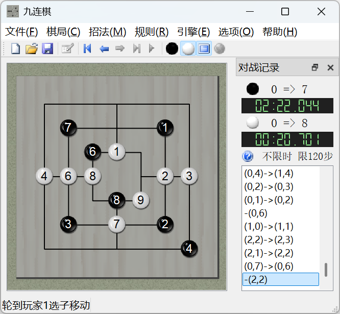

# 九连棋 NineChess

`NineChess` 是一个以 Qt 编写的九子棋类游戏项目，当前仓库同时包含图形界面程序 `NineChess` 和命令行测试程序 `NineChessConsole`。
现版本的核心代码已经整理为“纯棋局模型 + 控制层赛制管理 + 位棋盘 Alpha-Beta AI”的结构，更适合继续扩展规则、调试 AI 和做回归测试。

## 支持规则

### 莫里斯九子棋


Nine Men's Morris 是最经典的九子棋规则之一：

- 棋盘共有 24 个落点，双方各 9 枚棋子，轮流摆子。
- 任意一方形成“三连”后，可以提掉对手一子。
- 中局通常只能沿连线移动到相邻位置。
- 当一方只剩 3 子时，可以“飞子”到任意空位。
- 一方棋子少于 3 枚，或无法继续满足规则要求时判负。

### 成三棋

- 与莫里斯九子棋接近，但剩 3 子时不能飞子。
- 走棋阶段若被“闷”而无法行动，判负。

### 打三棋（12连棋）


这套规则使用带斜线的棋盘，双方各有 12 枚棋子：

1. 摆棋阶段被提子的点位会暂时成为禁点，直到进入走棋阶段。
2. 如果开局把棋盘摆满，按规则判先手负。
3. 摆子完成后，由后摆棋的一方先走。
4. 一步若同时形成多个“三连”，可以连续提子。
5. 其余基础规则与成三棋相近。

### 九连棋


九连棋是本项目默认规则，特点是棋子带编号：

1. 基础流程与成三棋相近。
2. 相同编号、相同位置形成的“三连”不能重复提子。
3. 走棋阶段若一方被“闷”，则由对手继续走棋，而不是直接判负。
4. 一步形成几个有效“三连”，就可以提几个子。

## 当前项目状态

### 图形界面


当前仓库里的 GUI 工程已经恢复到可编译状态，并保留了原有的桌面界面风格。项目中正在持续整理旧代码与新结构之间的边界，当前比较重要的约定如下：

- `NineChess` 只负责纯棋规、局面状态、命令解析、局面变换与哈希。
- 限时、限步、超时判负、AI 超时强制出招等赛制逻辑由 `GameController` 负责。
- 外部裁定统一走 `adjudicateWin()` / `adjudicateDraw()`；`giveup()` 只表示认输。
- 命令行与文本棋谱约定使用 `(c,p)`、`(c1,p1)->(c2,p2)`、`-(c,p)`、`-0`、`-1`、`==`。

### 已实现的主要功能

1. 支持 4 套内置规则：成三棋、打三棋、九连棋、莫里斯九子棋。
2. 图形化棋盘、棋子动画、音效与状态栏提示。
3. 棋谱文本显示、命令回放与历史浏览。
4. 局面镜像、翻转、离散角度旋转，以及黑白交换等变换能力。
5. 人机对战，以及双 AI 自对弈的基础能力。
6. 独立的命令行测试程序，便于调试规则、命令和局面文本输出。

## AI 说明

当前 `NineChess_AI_AB` 已经按照位棋盘结构重写，重点包括：

- Alpha-Beta 剪枝搜索。
- 迭代加深，在中止时尽量保留上一层完整结果。
- 使用 `chooseFast()`、`placeFast()`、`captureFast()` 这类无合法性检查的快速接口加速搜索。
- 基于棋子数量、手牌、成三、活二、机动性等指标的简洁估值。
- 利用内外翻转、左右镜像、离散旋转等对称局面做置换表复用。
- 在 `ACTION_PLACE` 等状态下，把 `selectedPos` 一并混入搜索哈希，避免等价类判断遗漏关键信息。

## 工程结构

项目目前大致遵循 MVC 思路：

### Model

- `NineChess/src/ninechess_common.h`
  核心公共常量、`Rule`、`ChessData`、位棋盘状态定义。
- `NineChess/src/ninechess.h/.cpp`
  纯棋局模型，负责规则、局面、命令、变换、哈希和胜负判定。
- `NineChess/src/ninechess_ai_ab.h/.cpp`
  Alpha-Beta AI。

### View

- `NineChess/src/ninechesswindow.*`
  主窗口。
- `NineChess/src/gamescene.*`
  棋局场景。
- `NineChess/src/gameview.*`
  棋局视图。
- `NineChess/src/boarditem.*`
  棋盘图元。
- `NineChess/src/pieceitem.*`
  棋子图元。
- `NineChess/src/manuallistview.h`
  棋谱列表视图。

### Controller

- `NineChess/src/gamecontroller.*`
  管理对局流程、限时限步、界面同步和 AI 调度。
- `NineChess/src/aithread.*`
  AI 线程包装。

### Console Test

- `NineChessConsole/ninechessconsole.cpp`
  直接复用核心模型，适合做规则验证、命令行走子和回归测试。

## 构建说明

### Windows / Visual Studio

- 解决方案文件：`ninechess.sln`
- GUI 工程：`NineChess`
- 控制台工程：`NineChessConsole`
- 当前 GUI 工程配置已验证可在 `Qt 5.15.2 (msvc2019_64) + MSVC v142` 环境下编译。

### qmake

- GUI 工程同时保留 `NineChess/ninechess.pro`。
- 对 MSVC 已显式追加 `/utf-8`，避免无 BOM 的 UTF-8 源码被误判为本地代码页。

## 编码与文本格式

当前仓库已经统一以下约定：

- 源码、Markdown 和工程文本文件使用 `UTF-8 without BOM`。
- Windows 下统一使用 `CRLF` 换行。
- `.editorconfig`、`.gitattributes`、`AGENTS.md` 一起约束编码与换行。
- GUI、Console、核心源码都应与 `/utf-8` 编译选项保持一致。

## 命令行调试

`NineChessConsole` 适合快速验证规则和命令，核心约定如下：

- 坐标全部使用 0-based。
- `rule N` 切换规则，`N` 范围为 `0..3`。
- `history` 查看命令历史，`undo` 回退一步，`new` 重新开局。
- 启动时可直接指定规则编号，例如：

```text
NineChessConsole.exe 2
NineChessConsole.exe --rule 2
```

## 测试与回归

仓库现在同时提供两层自动化测试：

- `tests/RuleHarness.vcxproj` + `tests/rule_harness.cpp`
  直接复用 `NineChess` 内核做规则级白盒测试，适合验证合法性判断、提子逻辑、堵死判负、三连历史、飞子规则等核心行为。
- `tests/Run-ConsoleBlackBoxTests.ps1`
  通过回放命令行输入、检查 `NineChessConsole` 输出做黑盒测试，适合验证 `rules` / `rule` / `history` / `undo` / `-0` / `==` / 启动参数等整机链路。

当前已经提供的测试入口如下：

- `tests/Test-Rule0-ChengSanQi.ps1`
  单独测试规则 0（成三棋）。
- `tests/Test-Rule1-DaSanQi.ps1`
  单独测试规则 1（打三棋 / 12 连棋）。
- `tests/Test-Rule2-JiuLianQi.ps1`
  单独测试规则 2（九连棋）。
- `tests/Test-Rule3-Morris.ps1`
  单独测试规则 3（莫里斯九子棋）。
- `tests/Run-All-RuleTests.ps1`
  顺序运行 4 个规则白盒测试，并输出汇总结果。
- `tests/Run-ConsoleBlackBoxTests.ps1`
  运行命令行黑盒回放测试，并输出汇总结果。
- `tests/Run-All-RegressionTests.ps1`
  一次性运行“规则白盒 + Console 黑盒”两层回归，是当前最推荐的总入口。

在 Windows PowerShell 中，可以直接这样执行总回归：

```powershell
powershell -ExecutionPolicy Bypass -File ".\tests\Run-All-RegressionTests.ps1"
```

如果只想跑规则测试，可以执行：

```powershell
powershell -ExecutionPolicy Bypass -File ".\tests\Run-All-RuleTests.ps1"
```

如果只想跑命令行黑盒测试，可以执行：

```powershell
powershell -ExecutionPolicy Bypass -File ".\tests\Run-ConsoleBlackBoxTests.ps1"
```

这套测试当前重点覆盖：

- 4 套规则下的开局、中局、提子与胜负判断；
- 非法招法不会污染局面与命令历史；
- 打三棋禁点复用、双三连多提子；
- 九连棋编号三连历史、被闷后的续走规则；
- 莫里斯九子棋三子飞行规则；
- `NineChessConsole` 的规则切换、历史、撤销、认输、判和与启动参数。

## 历史、许可与作者

- 更新历史见 [History.txt](./History.txt)
- 许可说明见 [Licence.txt](./Licence.txt)
- 原始项目作者：`liuweilhy`
- 联系方式：`liuweilhy@163.com`

项目最早的核心模型代码可追溯到 2013 年，Qt 图形界面版本在后续几年内逐步成形；当前仓库则在保留原始项目方向的基础上，继续整理规则层、控制层与 AI 的结构。

## 项目地址与下载

- 源码（Gitee）：[https://gitee.com/liuweilhy/NineChess](https://gitee.com/liuweilhy/NineChess)
- 发布页（Gitee）：[https://gitee.com/liuweilhy/NineChess/releases](https://gitee.com/liuweilhy/NineChess/releases)
- CSDN 资源页：[https://download.csdn.net/download/liuweilhy/10871298](https://download.csdn.net/download/liuweilhy/10871298)
- 百度网盘：[https://pan.baidu.com/s/1NZnmAUozbPt9K04fTouxMA](https://pan.baidu.com/s/1NZnmAUozbPt9K04fTouxMA)

## 捐助作者

