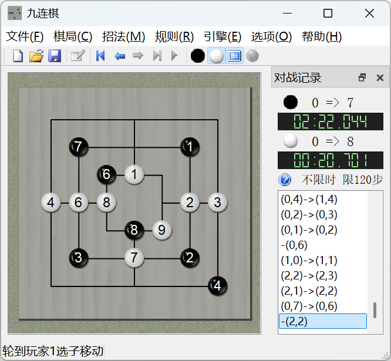

# 九连棋 NineChess

`NineChess` 是一个以 Qt 编写的九子棋类游戏项目，当前仓库同时包含图形界面程序 `NineChess` 和命令行测试程序 `NineChessConsole`。
现版本的核心代码已经整理为“纯棋局模型 + 控制层赛制管理 + 位棋盘 Alpha-Beta AI”的结构，更适合继续扩展规则、调试 AI 和做回归测试。
AI 引擎已支持多线程搜索（Lazy SMP）、时间预算与中途打断、根节点随机选择、静默搜索，并附带一套按规则独立的统计式开局库；所有 AI 行为都可以在 `NineChessConsole` 中复现与验证。

## 支持规则

### 莫里斯九子棋


Nine Men's Morris 是最经典的九子棋规则之一：

- 棋盘共有 24 个落点，双方各 9 枚棋子，轮流摆子。
- 任意一方形成“三连”后，可以提掉对手一子。
- 中局通常只能沿连线移动到相邻位置。
- 当一方只剩 3 子时，可以“飞子”到任意空位。
- 一方棋子少于 3 枚，或无法继续满足规则要求时判负。

### 成三棋

- 与莫里斯九子棋接近，但剩 3 子时不能飞子。
- 走棋阶段若被“闷”而无法行动，判负。

### 打三棋（12连棋）


这套规则使用带斜线的棋盘，双方各有 12 枚棋子：

1. 摆棋阶段被提子的点位会暂时成为禁点，直到进入走棋阶段。
2. 如果开局把棋盘摆满，按规则判先手负。
3. 摆子完成后，由后摆棋的一方先走。
4. 一步若同时形成多个“三连”，可以连续提子。
5. 其余基础规则与成三棋相近。

### 九连棋


九连棋是本项目默认规则，特点是棋子带编号：

1. 基础流程与成三棋相近。
2. 相同编号、相同位置形成的“三连”不能重复提子。
3. 走棋阶段若一方被“闷”，则由对手继续走棋，而不是直接判负。
4. 一步形成几个有效“三连”，就可以提几个子。

## 当前项目状态

### 图形界面


当前仓库里的 GUI 工程已经恢复到可编译状态，并保留了原有的桌面界面风格。项目中正在持续整理旧代码与新结构之间的边界，当前比较重要的约定如下：

- `NineChess` 只负责纯棋规、局面状态、命令解析、局面变换与哈希。
- 限时、限步、超时判负、AI 超时强制出招等赛制逻辑由 `GameController` 负责。
- 外部裁定统一走 `adjudicateWin()` / `adjudicateDraw()`；`giveup()` 只表示认输。
- 命令行与文本棋谱约定使用 `(c,p)`、`(c1,p1)->(c2,p2)`、`-(c,p)`、`-0`、`-1`、`==`。

### 棋谱文件格式

棋谱是纯命令流文本（UTF-8 无 BOM）：首行为对局配置命令 `r<规则号>s<限步数>t<限时分钟>`（如 `r2s100t10`，各段可省略、顺序不限，`0` 表示不限制），之后每行一条走子命令：

```text
r2s100t10
(1,0)
(0,0)
...
-1        ← 仅当超时判负时补写（后手负；先手负为 -0）
```

- 打开棋谱时按配置命令切换规则并恢复限时限步；配置命令由控制层与控制台识别，模型层不感知。
- 平局（判和、限步判和）与认输本来就以 `==`、`-0`、`-1` 命令记录在棋谱中，回放自然还原；超时判负没有命令记录，保存时补写负方的 `-0`/`-1`。
- 更早版本没有配置行的棋谱（纯走子命令）保持兼容，按当前规则回放。
- 配置命令的语法解析见 `parseSetupCommand()`（`ninechess.h`），控制层与控制台共用。

### 已实现的主要功能

1. 支持 4 套内置规则：成三棋、打三棋、九连棋、莫里斯九子棋。
2. 图形化棋盘、棋子动画、音效与状态栏提示。
3. 棋谱文本显示、命令回放与历史浏览；棋谱为纯命令流，首行配置命令记录规则与限时限步，打开时自动恢复，超时判负等外部裁定终局补写结果命令。
4. 局面镜像、翻转、离散角度旋转，以及黑白交换等变换能力。
5. 人机对战，以及双 AI 自对弈的基础能力。
6. 独立的命令行测试程序，便于调试规则、命令和局面文本输出。
7. 位棋盘 Alpha-Beta 搜索引擎：迭代加深、分片置换表（16 字节槽位 × 1M 条）、TT 走法/杀手/历史排序、静默搜索、Aspiration 窗口、重复局面惩罚（含根局面与真实对局历史）、点位结构价值评估、PVS 零宽试探、强制提子延伸、LMR 迟到走法减搜。
8. Lazy SMP 多线程搜索（默认线程数按 CPU 核数自动推导），支持时间预算与中途打断；动态深度（中局根局面追加 2 层）。
9. 根节点随机选择（精确打分 + 分差阈值 + 加权随机，种子可复现）。
10. 基于自对弈统计的开局库：按规则独立、16 对称规范化压缩、多轮训练累积评分。
11. 限步赛制急迫分：控制层传入剩余步数提示（模型层不感知），子力领先方随步数耗尽被推动转化优势，缓解磨平局。

## AI 说明

当前 `NineChess_AI_AB` 已经按照位棋盘结构重写。引擎的**完整算法逻辑、全部参数手册**
（分类/类型/默认值/取值范围/作用域/固化常量）、**哨兵语义警示与 A/B 实验方法学**见
[AI_ALPHABETA.md](./AI_ALPHABETA.md)；代码库总览（模型/状态机/规则/测试体系等总则）见
[AI_SUMMARY.md](./AI_SUMMARY.md)。要点速览：

- Alpha-Beta 剪枝 + 迭代加深 + 静默搜索；PVS 零宽试探、Aspiration 窗口、强制提子延伸、
  LMR 迟到走法减搜、重复局面惩罚（含根局面与真实对局历史）、TT 走法/杀手/历史排序。
- 置换表按规则独立、256 分片锁（多线程与双 AI 对弈互不阻塞）、定长桶数组 1M 条
  （16 字节槽位、32 字节对齐缓存行）；对称规范化默认"仅开局节点 canonical"（16 视角取最小键）；
  编号规则 hard 哈希增量维护，`selfcheck` 命令逐节点校验。
- Lazy SMP 多线程（默认线程数按 CPU 核数自动推导），支持时间预算与中途打断；
  动态深度（中局根局面追加 2 层）。
- 评估：按规则独立的 `EvalWeights` 权重表，另有点位结构价值、胜利临近压力分、限步急迫分等
  可覆盖项；`tune` 命令按规则坐标下降自动调参（终局验证防过拟合，打印可回贴权重行）。
- 根节点随机选择（精确打分 + 分差阈值 + 加权随机，种子可复现）与统计式开局库
  （按规则独立、16 对称规范化压缩）。

### 实测结论（Release x64）

- 哈希模式：开局空盘深度 7，canonical 35,356 节点 / 24ms vs 普通哈希 150,854 节点 / 55ms；真实中局深度 6，全对称模式 NPS 约 0.49M vs 普通 1.30M（每节点开销约 4 倍，节点数相同）。
- 多线程（16 逻辑核）：快照/哈希优化后单线程空盘深度 10 约 1.7M NPS；14 线程约 7.8M NPS（约 12 倍）；8 秒预算完成深度 11。
- 快照/哈希优化：编号规则（九连棋）空盘深度 10 由 5.5 秒降至 3.1 秒（PVS 后 2.2 秒），普通规则由 1.05 秒降至 0.74 秒；节点数/最佳走法/估值与优化前完全一致。
- 动态深度：中局固定深度 10 → 实际深度 12，35ms → 195ms，等效强度显著提升。
- 开局库（规则 2，500 局训练）：空盘条目 530 样本，首着 `(2,0)` 胜率 81%；深度差 5v7 对抗 60 局，执先方用书后胜率 13 → 18（书内走法 180 次零拒绝）。
- 观察：当前评估下先手优势明显（深度 5~8 自对弈后手几乎不赢），多数对局以步数上限平局收场，引擎偏保守、残局转化偏慢——评估"进取性"调参是后续重点；`vs` 已支持奇偶局交替执先与单侧参数（`wp`/`sp`/`ft`/`ms`/`tp`/`sr`）用于该方向的 A/B。
- 胜利临近压力分（`wp`）的实证边界：自对弈 60 局 8:2 压制关闭方（证明自洽）；但对外 80 局/臂 wp=150 vs wp=0 仅差 3 胜，小于同配置重跑噪声 ±5 胜（2026-09 重测，详见 `benchmark/results/evalab_*/CORRECTION.md`）——对外强度效应未证实，评估项 A/B 须先建立噪声基线再下结论。

## 工程结构

项目目前大致遵循 MVC 思路：

### Model

- `NineChess/src/ninechess_common.h`
  核心公共常量、`Rule`、`ChessData`、位棋盘状态定义。
- `NineChess/src/ninechess.h/.cpp`
  纯棋局模型，负责规则、局面、命令、变换、哈希和胜负判定。
- `NineChess/src/ninechess_ai_ab.h/.cpp`
  Alpha-Beta AI。
- `NineChess/src/ninechess_symmetry.h/.cpp`
  16 个等价视角的对称变换共享工具（AI 置换表与开局库共用）。
- `NineChess/src/ninechess_book.h/.cpp`
  统计式开局库（按规则独立、对称压缩、自对弈评分）。

### View

- `NineChess/src/ninechesswindow.*`
  主窗口。
- `NineChess/src/gamescene.*`
  棋局场景。
- `NineChess/src/gameview.*`
  棋局视图。
- `NineChess/src/boarditem.*`
  棋盘图元。
- `NineChess/src/pieceitem.*`
  棋子图元。
- `NineChess/src/manuallistview.h`
  棋谱列表视图。

### Controller

- `NineChess/src/gamecontroller.*`
  管理对局流程、限时限步、界面同步和 AI 调度。
- `NineChess/src/aithread.*`
  AI 线程包装。

### Console Test

- `NineChessConsole/ninechessconsole.cpp`
  直接复用核心模型，适合做规则验证、命令行走子和回归测试。

## 构建说明

### Windows / Visual Studio

- 解决方案文件：`ninechess.sln`
- GUI 工程：`NineChess`
- 控制台工程：`NineChessConsole`
- 当前 GUI 工程配置已验证可在 `Qt 5.15.2 (msvc2019_64) + MSVC v142` 环境下编译。

### qmake

- GUI 工程同时保留 `NineChess/ninechess.pro`。
- 对 MSVC 已显式追加 `/utf-8`，避免无 BOM 的 UTF-8 源码被误判为本地代码页。

## 编码与文本格式

当前仓库已经统一以下约定：

- 源码、Markdown 和工程文本文件使用 `UTF-8 without BOM`。
- Windows 下统一使用 `CRLF` 换行。
- `.editorconfig`、`.gitattributes`、`AGENTS.md` 一起约束编码与换行。
- GUI、Console、核心源码都应与 `/utf-8` 编译选项保持一致。

## 命令行调试

`NineChessConsole` 适合快速验证规则、命令和 AI 行为，核心约定如下：

- 坐标全部使用 0-based。
- `rule N` 切换规则，`N` 范围为 `0..3`。
- `history` 查看命令历史，`undo` 回退一步，`new` 重新开局。
- 启动时可直接指定规则编号，例如：

```text
NineChessConsole.exe 2
NineChessConsole.exe --rule 2
```

AI 调试命令（参数缺省用默认值，`help` 有完整说明）：

- `search [d] [t] [h] [r] [g] [th] [s] [pv] [a] [rep] [q] [dd] [pvs] [ext] [lmr]`
  单局面搜索，打印最佳走法、估值、深度、耗时、节点、NPS、TT 统计与根走法分数。
- `match [n] [d] [h] [r] [th] [s] [mp] [dd]`
  同配置自对弈 n 局，报告胜负 / 步数 / 节点 / NPS；`mp` 限步自动传入评估急迫项。
- `vs [n] [d1] [h1] [pv1] [d2] [h2] [pv2] [s] [a] [rep] [wp] [sp] [ft] [th] [ext] [lmr] [ms] [tp] [sr]`
  不同配置引擎对抗（深度差、哈希模式、点位价值等），用于强度 A/B；奇偶局交替执先，
  `wp`/`sp`/`ft`/`ext`/`lmr`/`ms`/`tp`/`sr` 只作用于引擎 2（`ext`/`lmr`/`ms`/`tp` 取 -1 = 沿用默认值）。
- `booktrain [n] [d] [s]` 自对弈训练开局库；`bookstat` 查看条目与胜率；
  `bookon` / `bookoff` 启停开局库（`match` / `vs` 生效）；`booksave` / `bookload` 存取。
- `selfcheck [n] [d]` 4 规则随机自对弈并逐节点校验增量哈希（引擎改动后的健康检查）。
- `tune [n] [d] [s] [r]` 按当前规则自动调参（坐标下降 + 终局验证，打印可回贴的权重行）。

参数速记：`h` 哈希模式（0 普通 / 1 仅开局规范化 / 2 全部规范化）、`r` 根节点随机、
`g` 随机分差、`th` 线程数（0 = 按 CPU 核数自动）、`s` 种子、`pv` 点位价值权重、
`a` Aspiration 窗口、`rep` 重复惩罚、`q` 静默搜索、`dd` 动态深度、`pvs` PVS 试探、
`ext` 强制提子延伸（默认开）、`lmr` LMR 减搜（默认开）、`ms` 封闭三连保护、
`tp` 连续阶段插值（默认关）、`sr` 剩余步数提示。

各参数的完整语义、命令默认值与引擎默认值的差异、关闭/哨兵规则
（`wp`/`pv` 无 -1 哨兵，`sp`/`ft`/`ms` 等 <0 = 沿用默认）见
[AI_ALPHABETA.md](./AI_ALPHABETA.md) §3/§4。

## 测试与回归

仓库现在同时提供两层自动化测试：

- `tests/RuleHarness.vcxproj` + `tests/rule_harness.cpp`
  直接复用 `NineChess` 内核做规则级白盒测试，适合验证合法性判断、提子逻辑、堵死判负、三连历史、飞子规则等核心行为。
- `tests/Run-ConsoleBlackBoxTests.ps1`
  通过回放命令行输入、检查 `NineChessConsole` 输出做黑盒测试，适合验证 `rules` / `rule` / `history` / `undo` / `-0` / `==` / 启动参数等整机链路。

当前已经提供的测试入口如下：

- `tests/Test-Rule0-ChengSanQi.ps1`
  单独测试规则 0（成三棋）。
- `tests/Test-Rule1-DaSanQi.ps1`
  单独测试规则 1（打三棋 / 12 连棋）。
- `tests/Test-Rule2-JiuLianQi.ps1`
  单独测试规则 2（九连棋）。
- `tests/Test-Rule3-Morris.ps1`
  单独测试规则 3（莫里斯九子棋）。
- `tests/Run-All-RuleTests.ps1`
  顺序运行 4 个规则白盒测试，并输出汇总结果。
- `tests/Run-ConsoleBlackBoxTests.ps1`
  运行命令行黑盒回放测试，并输出汇总结果。
- `tests/Run-All-RegressionTests.ps1`
  一次性运行“规则白盒 + Console 黑盒”两层回归，是当前最推荐的总入口。
- `tests/Run-MatchBattery.ps1`
  长时间实战对局验证：批量运行多组 vs 对抗（开局库开关、深度差、点位价值等配置），输出对比表；`-Games N` 控制每组局数。

在 Windows PowerShell 中，可以直接这样执行总回归：

```powershell
powershell -ExecutionPolicy Bypass -File ".\tests\Run-All-RegressionTests.ps1"
```

如果只想跑规则测试，可以执行：

```powershell
powershell -ExecutionPolicy Bypass -File ".\tests\Run-All-RuleTests.ps1"
```

如果只想跑命令行黑盒测试，可以执行：

```powershell
powershell -ExecutionPolicy Bypass -File ".\tests\Run-ConsoleBlackBoxTests.ps1"
```

这套测试当前重点覆盖：

- 4 套规则下的开局、中局、提子与胜负判断；
- 非法招法不会污染局面与命令历史；
- 打三棋禁点复用、双三连多提子；
- 九连棋编号三连历史、被闷后的续走规则；
- 莫里斯九子棋三子飞行规则；
- `NineChessConsole` 的规则切换、历史、撤销、认输、判和与启动参数；
- AI 对局验证：`Run-MatchBattery.ps1` 批量 vs 对抗（书开关 / 深度差 / 评估配置），`match` / `vs` 自对弈与配置对比。

## 历史、许可与作者

- 更新历史见 [History.txt](./History.txt)
- 许可说明见 [Licence.txt](./Licence.txt)
- 原始项目作者：`liuweilhy`
- 联系方式：`liuweilhy@163.com`

项目最早的核心模型代码可追溯到 2013 年，Qt 图形界面版本在后续几年内逐步成形；当前仓库则在保留原始项目方向的基础上，继续整理规则层、控制层与 AI 的结构。

## 项目地址与下载

- 源码（Gitee）：[https://gitee.com/liuweilhy/NineChess](https://gitee.com/liuweilhy/NineChess)
- 发布页（Gitee）：[https://gitee.com/liuweilhy/NineChess/releases](https://gitee.com/liuweilhy/NineChess/releases)
- CSDN 资源页：[https://download.csdn.net/download/liuweilhy/10871298](https://download.csdn.net/download/liuweilhy/10871298)
- 百度网盘：[https://pan.baidu.com/s/1NZnmAUozbPt9K04fTouxMA](https://pan.baidu.com/s/1NZnmAUozbPt9K04fTouxMA)

## 捐助作者

